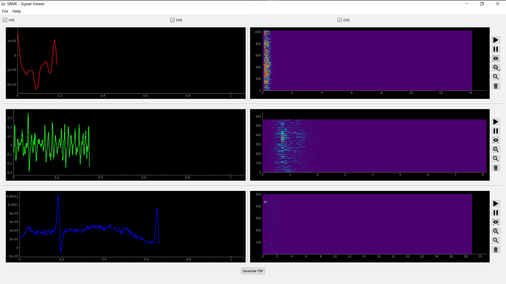

# multiChannelSignalViewer

r" alt="last-commit" />

<p align="center">
    
</p>

## Table of Contents

-   [About the Project](#about-the-project)
-   [Toolbox](#toolbox)
-   [Setting Up the Environment](#setting-up-the-environment)
-   [Acknowledgements](#acknowledgements)
-   [About](#about)

## About The Project

This is a Multi-Channel Bio-Signal Viewer GUI Application

## Toolbox

-   Python
    -   PyQt5
    -   pyqtgraph
    -   FPDF
    -   Scipy

## Setting Up the Environment


1. Create a Virtual Environment (Optional)
    ```sh
    python -m venv .env
    ```
1. Activate the virtual environment

    - using CMD
        ```sh
        .\.env\Scripts\activate
        ```
    - using PowerShell
        ```sh
        .\.env\Scripts\Activate.ps1
        ```
    - using Bash
        ```sh
        source .env/bin/activate
        ```

1. Install the requirements and dependancies
    ```sh
    pip install -r requirements.txt
    ```
1. Run the application
    ```sh
    python main.py
    ```

## About

This project is a part of the SBE309 curriculum (Biological Signal Processing) in the [Systems and Biomedical Engineering Department - Cairo University](http://bmes.cufe.edu.eg/)\
Dr.Tamer Ahmed\
TA. Christina Adly

